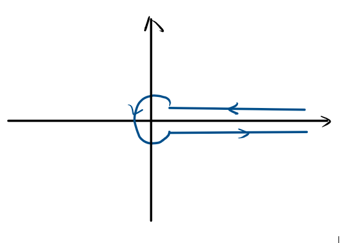
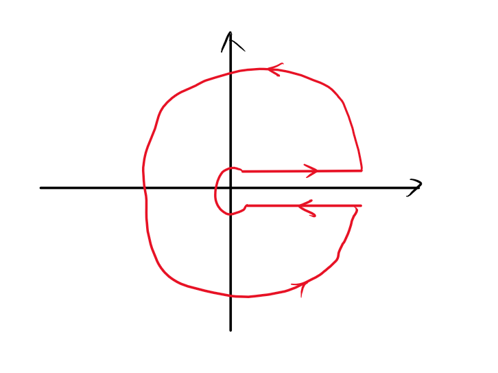

+++
title = '推导Riemann ζ函数的解析延拓与有效势规范依赖'
date = '2026-07-04'
tags = ['ζ函数', '解析延拓', '有效势', '正规化', '量子场论']
categories = ['量子场论']
summary = '从ζ函数的积分表示出发，通过围道积分实现解析延拓到全复平面，并讨论正规化方案与有效势的规范依赖问题。'
ShowToc = true
+++

# 推导Riemann $\zeta$ 函数的解析延拓

## $\zeta$ 函数的定义

$\zeta$ 函数的初始定义为 $$\begin{equation}
     \zeta (s)=\sum _{n=1}^{\infty }{\frac {1}{n^{s}}}
\end{equation}$$ 其中 $\operatorname{Re}(s) > 1$

借助$\Gamma$函数 $$\begin{equation*}
    \Gamma(s) = \int_{0}^{\infty} t^{s-1} e^{-t} dt
\end{equation*}$$ 通过换元$(t=nx)$可以得到$\zeta$函数的积分形式
$$\begin{equation}
    \zeta (s)={\frac {1}{\Gamma (s)}}\int _{0}^{\infty }{\frac {x^{s-1}}{e^{x}-1}}\mathrm {d} x
\end{equation}$$ 不过在此定义下，$\zeta$函数仍然被限制在 $\operatorname{Re}(s) >$
1，如果不这么取，那么在0附近的积分一定会发散

## $\zeta$ 函数的解析延拓

现在我们的任务是，将原本的定义域 $\operatorname{Re}(s) >$
1延拓到全复平面，为此，我们需要一个辅助函数，这个函数是一个在给定围道上的积分,而且他在全复平面上有定义：
$$\begin{equation}
    I(s) = \int_{C} \frac{z^{s-1}}{e^z - 1} dz
\end{equation}$$

其中围道C为

<figure id="fig:placeholder" data-latex-placement="h">

<figcaption>围道C</figcaption>
</figure>

因此 $$\begin{equation}
  \begin{split}
    I(s) &= \int_{C} \frac{z^{s-1}}{e^z - 1} dz\\&=\int_{\infty}^{\epsilon} \frac{x^{s-1}}{e^x - 1} dx+\int_{\epsilon}^{\infty} \frac{x^{s-1} e^{i 2\pi s}}{e^x - 1} dx+\int_{\epsilon}^{\epsilon} \frac{x^{s-1} }{e^x - 1} dx\\&=- \int_{\epsilon}^{\infty} \frac{x^{s-1}}{e^x - 1} dx+e^{i 2\pi s} \int_{\epsilon}^{\infty} \frac{x^{s-1}}{e^x - 1} dx\\&=(e^{i 2\pi s} - 1) \int_{0}^{\infty} \frac{x^{s-1}}{e^x - 1} dx
  \end{split}
\end{equation}$$

最后一步我们令$\epsilon\to0$,最终得到一个积分表达式。对比(2)式，这正是zeta函数定义式中的积分，因此我们可以建立等式

$$\begin{equation}
    \zeta(s) = \frac{1}{(e^{i 2\pi s} - 1) \Gamma(s)} \int_{C} \frac{z^{s-1}}{e^z - 1} dz
\end{equation}$$

但不要高兴太早了，虽然这个积分是在全复平面上的，但还有2个bug:（1）$\Gamma$函数在非正整数上无定义（2）当s=1时，这个积分就是个单值的，那么两条实轴上的积分便会抵消。我们先来修第一个bug
$$\begin{equation}
\begin{split}
    \zeta(s) &= \frac{1}{(e^{i 2\pi s} - 1) \Gamma(s)} \int_{C} \frac{z^{s-1}}{e^z - 1} dz\\&=\frac{1}{( e^{i\pi s} \left( e^{i\pi s} - e^{-i\pi s} \right) - 1) \Gamma(s)} \int_{C} \frac{z^{s-1}}{e^z - 1} dz\\&= \frac{1}{2i \cdot e^{i\pi s} \sin(\pi s) \Gamma(s)} \int_{C} \frac{z^{s-1}}{e^z - 1} dz
\end{split}
\end{equation}$$

现在利用Eular反射公式 $$\begin{equation}
    \Gamma(s)\Gamma(1-s) = \frac{\pi}{\sin(\pi s)}
\end{equation}$$

可得 $$\begin{equation}
    \begin{split}
        \zeta(s) &= \frac{\Gamma(1-s)}{2\pi i \cdot e^{i\pi s}} \int_{C} \frac{z^{s-1}}{e^z - 1} dz\\&=\frac{\Gamma(1-s) e^{-i\pi s}}{2\pi i} \int_{C} \frac{z^{s-1}}{e^z - 1} dz\\&=\frac{\Gamma(1-s) }{2\pi i} \int_{C} \frac{- \left( z \cdot e^{-i\pi} \right)^{s-1} }{e^z - 1} dz\\&=-\frac{\Gamma(1-s)}{2\pi i} \int_{C} \frac{(-z)^{s-1}}{e^z - 1} dz
    \end{split}
\end{equation}$$ 我们通过对$\Gamma$函数进行解析延拓解决了这个bug

再看第二个bug，当$s=1$时，积分外面充当分母，显然应该是0，而整个积分变为
$$\begin{equation}
    \begin{split}
        I(1) &= \int_{C} \frac{1}{e^z - 1} dz\\&=\oint_{C_\epsilon} \frac{1}{e^z - 1} dz=2\pi i
    \end{split}
\end{equation}$$

因此zeta函数的唯一的一个奇点是$s=1$,并且此处留数为1\
现在便只剩解决后面的积分了，我们可以构造一个闭合的围道（图2）并积分

<figure id="fig:placeholder" data-latex-placement="h">

<figcaption>闭合围道</figcaption>
</figure>

$$\begin{equation}
    \begin{split}
     2\pi i \sum \text{Residues}&=\int_{C_R} \frac{(-z)^{s-1}}{e^z - 1} dz-\int_{C} \frac{(-z)^{s-1}}{e^z - 1} dz\\&=-\int_{C} \frac{(-z)^{s-1}}{e^z - 1} dz
    \end{split}
\end{equation}$$

这里我们先设$\text{Re}(s) < 0$，这样当大圆半径 $R \to \infty$
时，大圆弧积分变为$0$（不易证），余下的这一项正是我们想求的积分，而显然在该闭合围道内的奇点都分布在虚轴上，而且上下都有，我们可以把上下分开来计算

（1）上半轴：$z_n = 2n\pi i$,其中$n = 1, 2, 3, \dots$ $$\begin{equation}
   \text{Res}(z_n) = (-z)^{s-1}=\left( 2n\pi e^{-i\frac{\pi}{2}} \right)^{s-1} = (2n\pi)^{s-1} \cdot e^{-i\frac{\pi}{2}(s-1)}=\text{Res}(z_n) = \text{Res}(z_n) = (2n\pi)^{s-1} \cdot e^{-i\frac{\pi s}{2}} \cdot i
\end{equation}$$

（2）下半轴：$z_{-n} = -2n\pi i$，同理可得 $$\begin{equation}
    \text{Res}(z_{-n}) = (2n\pi)^{s-1} \cdot e^{i\frac{\pi s}{2}} \cdot (-i)
\end{equation}$$

现在我们将两者加起来可得 $$\begin{equation}
    \begin{split}
        \text{SUM} &= (2n\pi)^{s-1} \cdot \left[ i e^{-i\frac{\pi s}{2}} - i e^{i\frac{\pi s}{2}} \right]\\&=(2n\pi)^{s-1} \cdot (-i) \cdot \left[ e^{i\frac{\pi s}{2}} - e^{-i\frac{\pi s}{2}} \right]\\&=2 \cdot (2n\pi)^{s-1} \sin\left(\frac{\pi s}{2}\right)
    \end{split}
\end{equation}$$

因此$\sum \text{Residues}$为 $$\begin{equation}
    \begin{split}
        \sum \text{Residues} &= \sum_{n=1}^{\infty} \left[ 2 \cdot (2\pi)^{s-1} \cdot n^{s-1} \cdot \sin\left(\frac{\pi s}{2}\right) \right]\\&=2 \cdot (2\pi)^{s-1}\sin\left(\frac{\pi s}{2}\right) \times \sum_{n=1}^{\infty} n^{s-1}\\&=2\cdot (2\pi)^{s-1} \sin\left(\frac{\pi s}{2}\right) \zeta(1-s)
    \end{split}
\end{equation}$$ 因此最终可推出zeta函数的函数方程 $$\begin{equation}
    \begin{split}
        \zeta(s) &= -\frac{\Gamma(1-s)}{2\pi i} \times \left( \int_{C} \frac{(-z)^{s-1}}{e^z - 1} dz \right)\\&=-\frac{\Gamma(1-s)}{2\pi i} \times \left\lbrace -2\pi i \left[ 2 \cdot (2\pi)^{s-1} \sin\left(\frac{\pi s}{2}\right) \zeta(1-s) \right] \right\rbrace\\&= 2^s \pi^{s-1} \sin\left(\frac{\pi s}{2}\right) \Gamma(1-s) \zeta(1-s)
    \end{split}
\end{equation}$$

不过还要注意一点，我们刚才在计算时先假设了$\text{Re}(s) < 0$确保大圆弧积分为0，那岂不是说这个式子只对$\text{Re}(s) < 0$成立？其实并非，由解析函数的唯一性定理可以证明，这个式子在全复平面上都成立。因此$\zeta$函数是在整个复平面上的亚纯函数（只在$s=1$处不解析）

## $\zeta$函数的一些数学讨论

1.  零点分布

    观察该式 $$\begin{equation}
            \zeta(s)= 2^s \pi^{s-1} \sin\left(\frac{\pi s}{2}\right) \Gamma(1-s) \zeta(1-s)
    \end{equation}$$

    这之中有一正弦因子，也就是说$s$=0或$s$=偶数是零点\...\...吗？

    如果$s$是个正偶数，sin确实是0，但是此时$\Gamma$函数发散了，不过我们可以通过二倍角公式凑Euler反射定理，得到
    $$\begin{equation}
            \zeta(s)= \frac{2^{s-1} \pi^s}{\Gamma(s) \cos\left(\frac{\pi s}{2}\right)} \zeta(1-s)
    \end{equation}$$

    这样一来就不存在发散，而且可以看出$s$取正偶数以及取0处并不是零点

    不过当$s$是负偶数时，$\Gamma$函数是收敛的，因此$s=-2,-4,-6,\dots$是函数的零点，这些零点被称为**平凡零点**

    而Riemann猜想就与$\zeta$函数的非平凡零点有关。Riemann认为$\zeta$函数的非平凡零点应该分布于$\text{Re}(s) = \frac{1}{2}$这条中轴线上

2.  关于求和（民科最爱）

    $\zeta$函数最初被定义为Euler对于素数分布猜想时所用到的无穷级数$\zeta (s)=\sum _{n=1}^{\infty }{\frac {1}{n^{s}}}$，当然这个无穷级数只在Re(s)
    $> 1$ 时收敛，但在解析延拓后，我们可以算出一些"匪夷所思"的值
    $$\begin{equation}
            \zeta (-1)=1+2+3+4+5+...=-{\frac {1}{12}}
    \end{equation}$$
    当然，这个结果只是将原本发散的无穷级数映射到复平面后解析延拓的结果，单纯小学代数的角度讨论这个值当然是没有意义的。不过这种处理在物理中使用非常广泛，后面我将介绍一二

# $\zeta$正规化

## 维度正规化回顾

维度正规化是我们最常用的剥离圈图发散的手段，其核心思想就是我们的圈动量积分会在$d=4$时发散，但小于4时收敛，因此我们将维度换为$D=4-\epsilon$,最后再使$\epsilon\to0$。我们先来回顾一下这种方法是如何剥离出发散部分的。

在做完wick转动并提出d维超球面后，我们需要解决这个积分 $$\begin{equation}
    \int_0^\infty \frac{k_E^{d-1}}{(k_E^2 + A)^n} d k_E
\end{equation}$$ 这个积分在经过两次换元后，变成这个形式
$$\begin{equation}
    \int_0^\infty \frac{y^{\frac{d}{2} - 1}}{(y + 1)^n} dy
\end{equation}$$ 而这其实就是Beta函数$B(a, b)$ $$\begin{equation}
    B(a, b) = \int_0^\infty \frac{t^{a - 1}}{(t + 1)^{a + b}} dt =\frac{\Gamma(a)\Gamma(b)}{\Gamma(a + b)}
\end{equation}$$ 对比可得$a = \frac{d}{2}$，$b = n - \frac{d}{2}$

而Beta函数积分的限制是$a > 0$且$b > 0$,这个条件就限制了只有在$d < 2n$时收敛。现在观察我们的这个积分结果

$$\begin{equation}
    \frac{\Gamma(\frac{d}{2}) \Gamma(n - \frac{d}{2})}{\Gamma(n)}
\end{equation}$$
如果我们直接代入$n=2, d=4$，$\Gamma(n - \frac{d}{2})$就一定会发散。但当我们代入的是$d = 4 - 2\epsilon$,那么原本发散的$\Gamma(0)$就变成$\Gamma(\epsilon)$。现在我们利用公式$\Gamma(\epsilon) = \frac{\Gamma(\epsilon+1)}{\epsilon}$进行解析延拓，并且对$\Gamma(1+\epsilon)$在$\epsilon=0$进行Taylor展开，便可得到
$$\begin{equation}
    \Gamma(\epsilon) = \frac{1 - \gamma_E \epsilon}{\epsilon} = \frac{1}{\epsilon} - \gamma_E + \dots
\end{equation}$$

发散项$\frac{1}{\epsilon}$成功地被提取了出来\
总结一下，维度正规化就是利用$\Gamma$函数的解析延拓提取出发散项

## $\zeta$函数正规化

在求解泛函行列式时，我们经常遇到对于无穷本征值的求和，导致发散。这个时候就可以使用$\zeta$函数正规化

设算符$\Delta$的本征值为$\lambda_n$，可以定义谱$\zeta$函数:
$$\begin{equation}
    \zeta(s, \Delta) = \sum_{n=1}^{\infty} \lambda_n^{-s}
\end{equation}$$ 现在对$s$求导 $$\begin{equation}
    \frac{d}{ds}\zeta(s, \Delta) = \sum_{n=1}^{\infty} [-\ln(\lambda_n)] \lambda_n^{-s}
\end{equation}$$ 显然，在$s = 0$处的导数为 $$\begin{equation}
    \zeta'(0, \Delta) = \sum_{n=1}^{\infty} [-\ln(\lambda_n)] \cdot \lambda_n^0 = -\sum_{n=1}^{\infty} \ln(\lambda_n)
\end{equation}$$\
由于$\ln[Det[\Delta]]=Tr\ln(\Delta)=\sum_{n=1}^{\infty} \ln(\lambda_n)$,因此
$$\begin{equation}
    \zeta'(0, \Delta) = -\ln[Det[\Delta]]
\end{equation}$$
所以，要计算一个发散的泛函行列式时，我们可以通过求该算符的谱$\zeta$函数在$s=0$处的一阶导（利用定义），这在一些本征值比较简单的例子中很简单（比如说一维谐振子），但更多的时候，我们不可能去一个个计算本征值，这时候就可以运用Heat
Kernal方法，连一个本征值都不用求。

# 单圈有效势的规范依赖性

## 快速回顾

对于标量QED（不选取特定规范），拉氏量为 $$\begin{equation}
    \mathcal{L} = \frac{1}{2} \partial_\mu \phi_i \partial^\mu \phi_i - \frac{1}{4} F_{\mu\nu} F^{\mu\nu} - \frac{\lambda}{4!} \phi^4 - e \epsilon_{ij} \partial_\mu \phi_i \phi_j A^\mu + \frac{1}{2} e^2 \phi^2 A^2 - \frac{1}{2\xi} (\partial_\mu A^\mu)^2
\end{equation}$$ 单圈有效势定义为 $$\begin{equation}
    V_{1L}^{(4)}(\hat{\phi}) = -\frac{i}{2} \int \frac{d^4 k}{(2\pi)^4} \ln [\text{Det} [i \mathcal{D}_0^{-1}]]
\end{equation}$$ 其中 $$\begin{equation}
    i\mathcal{D}_0^{-1} = \begin{pmatrix} iD{ij}^{-1}(\hat{\phi}, k) + iQ_{ij}(\hat{\phi}, k) & 0 \\ 0 & i\Delta_{\mu\nu}^{-1}(\hat{\phi}, k) \end{pmatrix}
\end{equation}$$ 再通过这个经过对角化的逆传播子矩阵可得到粒子的有效质量
$$\begin{equation}
    \mathcal{A}_1^2 = \frac{1}{12} (\lambda \hat{\phi}^2 + \hat{\phi}^2 \sqrt{\lambda^2 - 24\xi\lambda e^2}), \quad \mathcal{A}_3^2 = \frac{1}{2} \lambda \hat{\phi}^2,\\
    \mathcal{A}_2^2 = \frac{1}{12} (\lambda \hat{\phi}^2 - \hat{\phi}^2 \sqrt{\lambda^2 - 24\xi\lambda e^2}), \quad \mathcal{A}_4^2 = e^2 \hat{\phi}^2.
\end{equation}$$ 因此我们的积分就变为 $$\begin{equation}
    V_{1L}^{(4)}(\hat{\phi}) = -\frac{i}{2} \int \frac{d^4 k}{(2\pi)^4} \ln \big[ (k^2 - \mathcal{A}_1^2)(k^2 - \mathcal{A}_2^2) (k^2 - \mathcal{A}_3^2)(k^2 - \mathcal{A}_4^2)^3 \big]
\end{equation}$$ 通过维度正规化与MS重整化最终获得规范依赖的CW势
$$\begin{equation}
    V_{1L}^{(4)}(\hat{\phi}) = \frac{\hat{\phi}^4}{4!} \left[ \frac{1}{8\pi^2} \left( \frac{5}{6}\lambda^2 + 9e^4 - \xi\lambda e^2 \right) \ln \left( \frac{\hat{\phi}^2}{\mu^2} \right) \right]
\end{equation}$$

## 为什么会有规范依赖

1.  起源

    我们知道，行列式具有以下性质 $$\begin{equation}
        \ln[\det[\Delta_1 \Delta_2]] = \ln[\det[\Delta_1]] + \ln[\det[\Delta_2]]
    \end{equation}$$
    我们在计算$\ln [\text{Det} [i \mathcal{D}_0^{-1}]$时，也应用了这个性质，将分块对角矩阵拆开
    $$\begin{equation}
        \text{Det}[i\Delta_{\mu\nu}^{-1}(\hat{\phi}, k) \cdot (iD_{ij}^{-1}(\hat{\phi}, k) + iQ_{ij}(\hat{\phi}, k))] 
    = \text{Det}[i\Delta_{\mu\nu}^{-1}(\hat{\phi}, k)] \text{Det}[(iD_{ij}^{-1}(\hat{\phi}, k) + iQ_{ij}(\hat{\phi}, k))]
    \end{equation}$$ 最终通过因式分解，我们得到了 $$\begin{equation}
        \ln \big[ (k^2 - \mathcal{A}_1^2)(k^2 - \mathcal{A}_2^2) (k^2 - \mathcal{A}_3^2)(k^2 - \mathcal{A}_4^2)^3 \big]
    \end{equation}$$
    但这个文章指出，不能直接对无穷维矩阵进行拆分，因为Zeta正规化的迹是一个非线性算子。这个事实其实很容易理解
    因此，如果要强行拆分的话，就得加上一项$\mathbb{A}[\Delta_1, \Delta_2]$作为补偿，称为**乘法反常（multiplicative
    anomaly）** $$\begin{equation}
        \ln[\det[\Delta_1 \Delta_2]] = \ln[\det[\Delta_1]] + \ln[\det[\Delta_2]] + \mathbb{A}[\Delta_1, \Delta_2]
    \end{equation}$$

    因此，会不会就是因为我们之前疏忽了乘法反常项，导致最终结果出现了规范依赖？

2.  计算乘法反常

    乘法反常的计算是现代数学中的一个重要命题，我们在这里不可能完全证明，不过理清其思路还是可以的，首先我们先要介绍几个数学概念（当然这些并不是最严谨的数学定义，那样根本看不懂）\
    **拟微分算子（Pseudo-differential Operators）**

    将微分算符$\Delta = -\partial^2 + M^2$变换到动量空间，记作
    $$\begin{equation}
        \sigma(\Delta) = k^2 + M^2
    \end{equation}$$
    我们称这个多项式为算符的**象征（Symbol）**，记作$\sigma$。可以看到，对于这个微分算符，他的象征只有正数次幂。
    在QFT中，我们经常计算的是$\ln(\Delta)$和传播子$\Delta^{-1}$。我们来看看$\ln(\Delta)$的象征
    $$\begin{equation}
        \begin{split}
            \sigma(\ln \Delta) = \ln(k^2 + M^2) &= \ln\left[k^2 \left(1 + \frac{M^2}{k^2}\right)\right] \\&= 2\ln(k) + \ln\left(1 + \frac{M^2}{k^2}\right)
        \end{split}
    \end{equation}$$ 对其展开可得 $$\begin{equation}
        \sigma(\ln \Delta) = 2\ln(k) + M^2 k^{-2} - \frac{1}{2} M^4 k^{-4} + \frac{1}{3} M^6 k^{-6} - \dots
    \end{equation}$$
    可以看出，他的象征不再是有限的正数次幂多项式了，而是变成了一个包含无数个
    $k$
    的负偶数次幂的无穷级数。我们称这种包含负数次幂象征的算符，就叫作**拟微分算子（Pseudo-differential
    Operators）**

    现在看回我们的求迹，假设我们对算符$A$求迹，通过插入完备性关系可以得到
    $$\begin{equation}
        \text{Tr}(A) = \int d^d x \int \frac{d^d k}{(2\pi)^d} \ \langle x | A | k \rangle e^{i k \cdot x}
    \end{equation}$$ 中间的内积其实就是 $$\begin{equation}
        \langle x | A | k \rangle = \sigma(A)(x,k) \langle x | k \rangle = \sigma(A)(x,k) e^{i k \cdot x}
    \end{equation}$$ 最后整理可以得到 $$\begin{equation}
        \text{Tr}(A) = \int d^d x \int \frac{d^d k}{(2\pi)^d} \ \sigma(A)(x,k)
    \end{equation}$$
    现在我们成功地将抽象算符的迹转化成他的象征在相空间上的积分。那么对于拟微分算子，我们同样也可以直接研究其象征对积分变量幂次的影响从而找到发散项。这里就直接简要示意。在d维欧几里得空间中积分，动量部分为
    $$\begin{equation}
        \int k^p \cdot k^{d-1} dk = \int k^{p + d - 1} dk
    \end{equation}$$
    其中$k^p$来自于$\sigma(A)(x,k)$，而由于拟微分算子，他的展开的幂次是负的，因此当$p=-d$时，会出现对数发散。而乘法反常的本质，正是这些对数发散在拆分算符时残留的干涉项。那么想要计算乘法反常，我们就要精准地提取出这些$p=-d$的发散项。为此我们需要用到非交换几何中的非常重要的技术，即**Wodzicki留数**\
    **Wodzicki留数**

    又称**非交换留数（Noncommutative
    residue）**，类似于普通的留数，其作用就是提取出$p=-d$的项。对于作用在
    $d$ 维时空流形上的任意一个伪微分算符 $A$，它的
    Wodzicki留数在数学上被定义为： $$\begin{equation}
        \text{Res}(A) = \frac{1}{(2\pi)^d} \int d^d x \int_{|k|=1} d\Omega_k \ a_{-d}(x, k)
    \end{equation}$$ 其中$a_{-d}(x, k)$把算符 $A$ 的象征展开，阶数等于
    $-d$的那一项,而且它是一个阶数为 $-d$
    的齐次函数。因此他一定可以在极坐标下分离变量 $$\begin{equation}
        a_{-d}(x, k) = \frac{1}{|k|^d} \cdot f(x, \theta)
    \end{equation}$$ 代入原式中 $$\begin{equation}
        \begin{split}
            \int a_{-d}(x, k) d^d k &= \int \left( \frac{1}{|k|^d} f(x, \theta) \right) \left( |k|^{d-1} d|k| \ d\Omega_k \right)\\&= \left( \int \frac{|k|^{d-1}}{|k|^d} d|k| \right) \times \left( \int f(x, \theta) d\Omega_k \right)\\&= \left( \int \frac{1}{|k|} d|k| \right) \times \left( \int f(x, \theta) d\Omega_k \right)\\&= (\log |k|) \times \left( \text{角向积分} \right)
        \end{split}
    \end{equation}$$
    我们再次看到，$-d$阶的那一项正好提取出了对数发散。因此计算Wodzicki留数最重要的就是计算$a_{-d}(x, k)$

    文章中引用前人的结果，给出了乘法反常与Wodzicki留数之间的关系
    $$\begin{equation}
        \mathbb{A}[\Delta_1, \Delta_2] = \frac{r_2}{2r_1(r_1+r_2)} \text{Res}\left[ (\log \Delta_1 - \log \Delta_2)^2 \right]
    \end{equation}$$ 其中 $r_1$ 和 $r_2$
    分别为两个伪微分算子的阶数。这个留数的计算比较麻烦（不过不算难，整体思路就是对这个算符多项式化简并展开，最后强制令动量的阶数为$-d$），这里就直接给出结果
    $$\begin{equation}
        a_{-4}(x, k) = \left( \frac{1}{|k|^4} \right) \times \left( (-1)^2 \sum_{n=1}^{1} \frac{1}{n(2-n)} [(\mathcal{A}_1^2)^n - (\mathcal{A}_2^2)^n][(\mathcal{A}_1^2)^{2-n} - (\mathcal{A}_2^2)^{2-n}] \right)
    \end{equation}$$ 别忘了前面总体还体积因子，最终可得到乘法反常
    $$\begin{equation}
        \mathbb{A}[\Delta_1, \Delta_2] \supset \frac{(-1)^q \mathcal{V}_d}{4(4\pi)^q \Gamma(q)} \sum_{n=1}^{q-1} \frac{1}{n(q-n)} [(\mathcal{A}_1^2)^n - (\mathcal{A}_2^2)^n][(\mathcal{A}_1^2)^{q-n} - (\mathcal{A}_2^2)^{q-n}]
    \end{equation}$$
    其中$q = \frac{1}{2}d$。注意这里使用的是"包含"，因为这并不是完整的乘法反常，而只是对有效势计算有用的一部分（扔掉背景场的时空导数）。有了这些基础，我们可以开始计算了。羊毛出在羊身上，我们只用计算Goldstone
    Boson与横向光子耦合的部分，这部分导致了规范依赖性，因此这里我们计算的是局域的**反常密度**
    $$\begin{equation}
        \begin{split}
            a[\Delta_1, \Delta_2](\xi) &= \frac{\mathbb{A}[\Delta_1, \Delta_2]}{\mathcal{V}_4} \\&= \frac{(-1)^2}{4(4\pi)^2 \times 1} \times \frac{1}{1 \times 1} [(\mathcal{A}_1^2)^1 - (\mathcal{A}_2^2)^1][(\mathcal{A}_1^2)^1 - (\mathcal{A}_2^2)^1]\\&=\frac{1}{64\pi^2} [(\mathcal{A}_1^2) - (\mathcal{A}_2^2)]^2\\&=\frac{1}{64\pi^2} \times \frac{1}{36}\hat{\phi}^4 (\lambda^2 - 24\xi\lambda e^2)\\&=-\frac{2\xi e^2\lambda\hat{\phi}^4}{4!(8\pi^2)}
        \end{split}
    \end{equation}$$ 将这部分放在原式后面可以得到 $$\begin{equation}
        \begin{split}
       V_{eff}^{(1L)}(\hat{\phi})&= \frac{\hat{\phi}^4}{4!(8\pi^2)} \left\lbrace \left[ \frac{5\lambda^2}{6} + 9e^4 - \xi e^2 \lambda \right] - \frac{1}{2} \left[ -2\xi e^2\lambda \right] \right\rbrace \ln(\frac{\hat{\phi}^2}{\mu^2})\\&=\frac{\hat{\phi}^4}{64\pi^2} \left[ \frac{5\lambda^2}{18} + 3e^4 \right] \ln(\frac{\hat{\phi}^2}{\mu^2})
        \end{split}
    \end{equation}$$
    虽然我们得到了理想的结果，但计算这个乘法反常太难了。不过这个乘法反常既然是由我们一开始乱拆矩阵带来的，那我们可不可以一开始就不拆？当然可以，这就要用到**Heat
    kernel**

# Heat kernel展开

## 什么是热核？

我们先看含时Schrödinger方程 $$\begin{equation}
    i \frac{\partial \psi}{\partial t} = H \psi
\end{equation}$$
他的解显然是不断震荡的，而我们如果对虚时进行积分（$t \to -i\tau$），方程就会变成
$$\begin{equation}
    \frac{\partial \psi}{\partial \tau} = -H \psi
\end{equation}$$
而这正是热传导方程，他说明解会随着虚时衰减。我们可以通过这种方法，将QM中的粒子传播过程，在数学上等价于热量在时空中的扩散过程。

热传导方程的基本解就是**热核（Heat kernel）**,为随时间变化的高斯函数
$$\begin{equation}
    K(t, x, y) = \frac{1}{(4\pi t)^{d/2}} e^{-|x-y|^2 / 4t}
\end{equation}$$ 可以用Dirac符号表示为系统演化算符的矩阵元
$$\begin{equation}
    K(x, y; t) = \langle x | e^{-t\Delta} | y \rangle
\end{equation}$$

那么他怎么和我们的求迹联系起来呢？很简单，只要让终点和起点一样就行了，这也就和我们计算单圈有效势时真空涨落回起点一样
$$\begin{equation}
    K(x, x; t) = \langle x | e^{-t\Delta} | x \rangle
\end{equation}$$ 因此 $$\begin{equation}
    \text{Tr}(e^{-t\Delta}) = \int d^d x \ K(x, x; t)
\end{equation}$$

## $\zeta$正规化

我们现在使用$\zeta$正规化的方法，看看与热核会建立什么联系

先定义谱zeta函数 $$\begin{equation}
    \zeta_\Delta(s) = \sum_{n} \lambda_n^{-s}
\end{equation}$$

我们现在利用$\Gamma$函数来化简这个式子 $$\begin{equation}
    \begin{split}
        \Gamma(s) &= \int_{0}^{\infty} x^{s-1} e^{-x} dx\\&=\int_{0}^{\infty} (\lambda_n t)^{s-1} e^{-\lambda_n t} (\lambda_n dt)\\&=\int_{0}^{\infty} \lambda_n^{s-1} t^{s-1} e^{-\lambda_n t} \lambda_n dt\\&=\lambda_n^s \int_{0}^{\infty} t^{s-1} e^{-\lambda_n t} dt
    \end{split}
\end{equation}$$ 得到关于本征值的积分 $$\begin{equation}
    \lambda_n^{-s} = \frac{1}{\Gamma(s)} \int_{0}^{\infty} t^{s-1} e^{-\lambda_n t} dt
\end{equation}$$ 因此 $$\begin{equation}
    \sum_{n} \lambda_n^{-s} = \sum_{n} \left[ \frac{1}{\Gamma(s)} \int_{0}^{\infty} t^{s-1} e^{-\lambda_n t} dt \right]=\frac{1}{\Gamma(s)} \int_{0}^{\infty} dt \ t^{s-1} \left( \sum_{n} e^{-\lambda_n t} \right)
\end{equation}$$
而显然，现在括号里的这玩意儿就是我们的演化算符$e^{-t\Delta}$的迹，因此
$$\begin{equation}
    \begin{split}
        \zeta_\Delta(s) &= \frac{1}{\Gamma(s)} \int_{0}^{\infty} dt \ t^{s-1} \text{Tr}(e^{-t\Delta})\\&=\frac{1}{\Gamma(s)} \int d^4x \int_0^\infty dt \ t^{s-1} \text{tr} K(t,x,x,\Delta)
    \end{split}
\end{equation}$$

## Schwinger参数化

显然公式(63)长得和Schwinger参数化很像 $$\begin{equation}
\begin{split}
    \frac{1}{A^n} &= \frac{1}{\Gamma(n)} \int_{0}^{\infty} dt \ t^{n-1} e^{-tA}\\
    \frac{1}{A} &= \int_{0}^{\infty} dt \ e^{-tA}
\end{split}
\end{equation}$$

因此我们这里引入的虚时$t$其实就是Schwinger参数$t$

在我们算传播子时，可以利用Schwinger参数化写作 $$\begin{equation}
    \frac{1}{k^2 + M^2} = \int_{0}^{\infty} dt \ e^{-t(k^2 + M^2)}
\end{equation}$$

我们观察一下发生紫外发散($k \to \infty$)时右边的积分会怎么变化。显然，如果我们的t比较大，那指数部分会迅速变为0。而只有$t \sim 1/k^2$，即$t \to 0$时才会幸存。也就是说，我们关心的紫外发散，都集中于$t \to 0$处。

## 完整计算

现在回到我们的拉氏量 $$\begin{equation}
    \mathcal{L} = \frac{1}{2} \partial_\mu \phi_i \partial^\mu \phi_i - \frac{1}{4} F_{\mu\nu} F^{\mu\nu} - \frac{\lambda}{4!} \phi^4 - e \epsilon_{ij} \partial_\mu \phi_i \phi_j A^\mu + \frac{1}{2} e^2 \phi^2 A^2 - \frac{1}{2\xi} (\partial_\mu A^\mu)^2
\end{equation}$$ 经过一段枯燥计算可以得到算符矩阵 $$\begin{equation}
    \Delta = \begin{pmatrix} -\partial^2\delta_{ab} + \frac{\lambda}{6}\hat{\phi}^2\delta_{ab} + \frac{\lambda}{3}\hat{\phi}_a\hat{\phi}_b & e\epsilon_{ab'}\partial_\nu\hat{\phi}_{b'} \\ -e\epsilon_{a'b}\partial_\mu\hat{\phi}_{a'} & (-\partial^2 + e^2\hat{\phi}^2)\delta_{\mu\nu} + (1-\frac{1}{\xi})\partial_\mu\partial_\nu \end{pmatrix}
\end{equation}$$ 它可以被分为三部分 $$\begin{equation}
    \Delta \equiv \frac{\delta^2 \mathcal{L}}{\delta \Phi^2} = D^2 + M^2 + U
\end{equation}$$ $$\begin{equation}
    M^2 = \begin{pmatrix} \frac{\lambda}{2}\hat{\phi}^2 \mathbf{\delta_{ab}} & 0 \\ 0 & -e^2\hat{\phi}^2 \mathbf{\delta_{\mu\nu}} \end{pmatrix}
\end{equation}$$
把偏导提出来就是势能矩阵，懒得提了。一般来说，这里的质量矩阵与势能矩阵是不对易的，而我们现在要对热核求迹，也就是求$\text{Tr}(e^{-t\Delta})$，因此不能轻易使用指数的运算规律（此时$e^{A+B} \neq e^A e^B$）。那既然$[M^2, U] \neq 0$，我们该怎么算呢？其实只需要一点小变形就可以看出端倪，先设$e^{-t(A + B)} = e^{-tA} \cdot F(t)$
$$\begin{equation}
    \begin{split}
        F(t) &= e^{tA} \cdot e^{-t(A + B)}\\
        \frac{d}{dt} F(t) &= \left( \frac{d}{dt} e^{tA} \right) \cdot e^{-t(A + B)} + e^{tA} \cdot \left( \frac{d}{dt} e^{-t(A + B)} \right)
        \\&=- e^{tA} B e^{-t(A + B)}\\&=- e^{tA} B \mathbf{(e^{-tA} e^{tA})} e^{-t(A + B)}
        \\&=- \left( e^{tA} B e^{-tA} \right) \cdot \left( e^{tA} e^{-t(A + B)} \right)\\&=- \tilde{B}(t) F(t)        
    \end{split}
\end{equation}$$ 其中$\tilde{B}(t) = e^{tA} B e^{-tA}$
显然，我们在相互作用绘景中解过的方程，他的结果用Dyson级数展开
$$\begin{equation}
    e^{-t(A + B)} = e^{-tA} \cdot \mathcal{T} \exp\left( - \int_0^t e^{tA} B e^{-tA} dt' \right)
\end{equation}$$ 那我们现在就可以求这个迹了 $$\begin{equation}
    \begin{split}
        \text{tr} K(t, x, x, \Delta) &= \text{tr} \int \frac{d^4p}{(2\pi)^4} \langle x | e^{-M^2 t} \mathcal{T} \exp\left[ - \int_0^t (\partial^2 + e^{M^2 t'} U e^{-M^2 t'}) dt' \right] | p \rangle \langle p | x \rangle\\&=\text{tr} \int \frac{d^4p}{(2\pi)^4} e^{-M^2 t} \langle x | \mathcal{T} \exp\left[ - \int_0^t (\partial^2 + e^{M^2 t'} U e^{-M^2 t'}) dt' \right] | p \rangle e^{ipx}\\&=\text{tr} \int \frac{d^4p}{(2\pi)^4} e^{-M^2 t} \langle x | p \rangle e^{ipx} \mathcal{T} \exp\left[ - \int_0^t ((\partial_\mu + ip_\mu)^2 + e^{M^2 t'} U e^{-M^2 t'}) dt' \right]\\&=\text{tr} \int \frac{d^4p}{(2\pi)^4} e^{-M^2 t} e^{p^2 t} \mathcal{T} \exp\left[ - \int_0^t (\partial^2 + 2ip \cdot \partial + e^{M^2 t'} U e^{-M^2 t'}) dt' \right]
    \end{split}
\end{equation}$$ 做变量替换得 $$\begin{equation}
    \text{tr} K(t, x, x, \Delta) = \text{tr} \int \frac{d^4 p}{(2\pi)^4 t^2} e^{-M^2 t} e^{-p^2} \mathcal{T} \exp \left[ -\int_0^t \left( \partial^2 + \frac{2ip \cdot \partial}{\sqrt{t}} + e^{M^2 t'} U e^{-M^2 t'} \right) dt' \right]
\end{equation}$$
接下来我们展开这个时序部分，先把后面积分里的一坨定义为算符$A(t')$，单独写出时序部分
$$\begin{equation}
    \mathcal{F}(t, A) = \mathcal{T} \exp\left( - \int_0^t A(t')dt' \right) = 1 + \sum_{n=1}^{\infty} (-1)^n f_n(t, A)
\end{equation}$$ 这个$f_n(t, A)$就蕴含了时序乘积部分 $$\begin{equation}
    f_n(t, A) = \int_0^t ds_1 \int_0^{s_1} ds_2 \dots \int_0^{s_{n-1}} ds_n A(s_1)A(s_2)\dots A(s_n)
\end{equation}$$ 其中那一坨$A$直接写出来是 $$\begin{equation}
    A = \begin{pmatrix} \left( \partial^2 + \frac{2ip\cdot\partial}{\sqrt{t}} - \frac{\lambda}{3}\hat{\phi}^2 \right)\delta_{ab} + \frac{\lambda}{3}\hat{\phi}_a\hat{\phi}_b & e\epsilon_{ab'}\partial_\nu\hat{\phi}_{b'} + \frac{ie\epsilon_{ab'}p_\nu\hat{\phi}_{b'}}{\sqrt{t}} \\ -e\epsilon_{a'b}\partial_\mu\hat{\phi}_{a'} - \frac{ie\epsilon_{a'b}p_\mu\hat{\phi}_{a'}}{\sqrt{t}} & -\left( \partial^2 + \frac{2ip\cdot\partial}{\sqrt{t}} \right)\delta_{\mu\nu} + \left(1-\frac{1}{\xi}\right)\left( \partial_\mu\partial_\nu - \frac{p_\mu p_\nu}{t} + \frac{2ip_\mu\partial_\nu}{\sqrt{t}} \right) \end{pmatrix}
\end{equation}$$
现在我们可以算真正的物理量了，我们前面说了zeta正规化与热核之间的关系
$$\begin{equation}
    \zeta_\Delta(s) = \frac{1}{\Gamma(s)} \int d^4x \int_0^\infty dt \ t^{s-1} \text{tr} K(t,x,x,\Delta)
\end{equation}$$ 由于有效作用量的定义是 $$\begin{equation}
    \begin{split}
        S_{\text{eff}} = c_s \log(\det \Delta) &= c_s \text{Tr}(\log \Delta)\\&=\mathbf{- c_s \zeta_\Delta'(0)}
    \end{split}
\end{equation}$$ 因此 $$\begin{equation}
\begin{split}
    S_{\text{eff}} &= \int d^4x \ c_s \text{tr} \int_0^\infty \mathbf{\frac{dt}{t}} K(t,x,x,\Delta)\\
    \mathbf{\mathcal{L}_{\text{eff}} &= c_s \text{tr} \int_0^\infty \frac{dt}{t} K(t,x,x,\Delta)}
\end{split}
\end{equation}$$ 代入我们刚才计算热核的结果 $$\begin{equation}
    \begin{split}
        \mathcal{L}_{\text{eff}} = c_s \text{tr} \int_0^\infty \frac{dt}{t^3} \int \frac{d^4 p}{(2\pi)^4} e^{-M^2 t} e^{p^2 t} \left[ 1 + \sum_n (-1)^n f_n(t, A) \right]
    \end{split}
\end{equation}$$
我们来分析一下这个式子的量纲，由于$f_n \sim  U^n$，$[U]=2$,$[t] = \mathbf{-2}$,因此我们只用计算$f_2$，就能确保作用量量纲为0。因此
$$\begin{equation}
    \begin{split}
        \mathcal{L}_{\text{eff}}^{(4)} &= c_s \text{tr} \int_0^\infty \frac{dt}{t^3} \int \frac{d^4 p}{(2\pi)^4} e^{-M^2 t} e^{p^2} f_2(t, A)\\&= c_s \text{tr} \int_0^\infty \frac{dt}{t^3} 2\pi^2 \int_0^\infty \frac{p^3 dp}{(2\pi)^4} e^{-M^2 t} e^{p^2} f_2(t, A),
    \end{split}
\end{equation}$$
这个积分很恶心，因为$f_2$这里巨大一坨。但能积出来，结果是
$$\begin{equation}
    \begin{aligned} \mathcal{L}_{\text{eff}}^{(4)}= &-\frac{1}{8} \frac{1}{8\pi^2} \left[ \frac{5\lambda^2}{18} \hat{\phi}^4 \left( \log \left( \frac{\lambda \hat{\phi}^2}{2} \right) - \frac{3}{2} \right) + 3e^4 \hat{\phi}^4 \left( \log(e^2 \hat{\phi}^2) - \frac{5}{6} \right) + \left( 1 - \frac{1}{\xi} \right)^2 \log(e^2 \hat{\phi}^2) \partial^4 \right. \\ &- 2\left( 1 - \frac{1}{\xi} \right) e^2 (\log(e^2 \hat{\phi}^2) - 1) \partial^2 \hat{\phi}^2 + \left. 2e^2 \partial_\mu \hat{\phi}_a \partial^\mu \hat{\phi}_a \left( 1 - \frac{\frac{\lambda \hat{\phi}^2}{2} \log(\frac{\lambda \hat{\phi}^2}{2}) - e^2 \hat{\phi}^2 \log e^2 \hat{\phi}^2}{\frac{\lambda \hat{\phi}^2}{2} - e^2 \hat{\phi}^2} \right) \right] \end{aligned}
\end{equation}$$ 固定背景场便可得到CW势能 $$\begin{equation}
    V_{\text{CW}}^{(1L)} = \frac{1}{4!} \frac{1}{8\pi^2} \left[ \frac{5\lambda^2}{6} \hat{\phi}^4 \left( \log \left( \frac{\lambda \hat{\phi}^2}{2} \right) - \frac{3}{2} \right) + 9e^4 \hat{\phi}^4 \left( \log(e^2 \hat{\phi}^2) - \frac{5}{6} \right) \right]
\end{equation}$$
